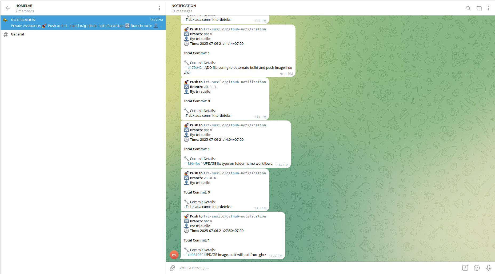

# 📦 GitHub Webhook to Telegram Notification Bot

A lightweight, production-ready webhook service to forward GitHub events (Push, Pull Request, Issues, Deployment) to Telegram chats in real-time. Built with **FastAPI**, supports **Docker**, **GHCR**, and secure webhook signature verification.



---

## 🚀 Features

✅ Receive GitHub webhook events  
✅ Send formatted notifications to Telegram groups or threads  
✅ Secure HMAC signature verification for incoming webhooks  
✅ Modular, clean project structure  
✅ Ready for containerization with Docker & GHCR  
✅ Supports deployment via Docker Compose  

---

## 🛠️ Technology Stack

- [FastAPI](https://fastapi.tiangolo.com/) – High-performance async API
- [httpx](https://www.python-httpx.org/) – Async HTTP client for Telegram API
- [Docker](https://www.docker.com/) – Containerized deployment
- [GitHub Container Registry (GHCR)](https://ghcr.io) – Image hosting
- [dotenv](https://pypi.org/project/python-dotenv/) – Config management

---

## ⚙️ Project Structure

```
.
├── app/
│   ├── main.py               # FastAPI entrypoint
│   ├── events/               # Event handlers (push, PR, issues, etc.)
│   ├── utils/                # Helper functions (Telegram integration, signature verification)
├── .env                      # Environment variables (token, chat ID, secret)
├── requirements.txt          # Python dependencies
├── Dockerfile                # Multi-stage Docker build
├── docker-compose.yml        # Local deployment configuration
└── .github/workflows/        # CI/CD pipelines (optional)
```

---

## 📦 Quick Start (Development)

1. Install dependencies:

```bash
python -m venv venv
source venv/bin/activate
pip install -r requirements.txt
```

2. Set up `.env` file:

```ini
TELEGRAM_BOT_TOKEN=your_bot_token
TELEGRAM_CHAT_ID=your_chat_id
TELEGRAM_THREAD_ID=optional_thread_id
WEBHOOK_SECRET=your_github_webhook_secret
```

3. Run locally:

```bash
uvicorn app.main:app --host 0.0.0.0 --port 8000
```

4. Expose port (if testing with GitHub):

- Use services like [ngrok](https://ngrok.com/) or deploy to server.

---

## 🐳 Run with Docker

```bash
docker build -t webhook-bot .
docker run -d -p 8000:8000 --env-file .env webhook-bot
```

Or with Docker Compose:

```bash
docker-compose up -d
```

---

## ☁️ Deploy via GHCR

- Image available at: `ghcr.io/tri-susilo/github-notification:latest`
- Example pull & run:

```bash
docker pull ghcr.io/tri-susilo/github-notification:latest
docker run -d -p 8000:8000 --env-file .env ghcr.io/tri-susilo/github-notification:latest
```

---

## 🔒 Security: GitHub Webhook Secret

- Set a `WEBHOOK_SECRET` in `.env`
- Configure the same secret in your GitHub repository:
  - **Settings** → **Webhooks** → **Secret**
- Ensures only valid requests are processed

---

## ✉️ Supported GitHub Events

- `push` – Detailed commit summaries  
- `pull_request` – PR opened, merged, closed  
- `issues` – New issue, closed issue  
- `deployment` – Deployment started  

More events can be added easily via modular handlers.

---

## 💡 Customization

- Add new event handlers in `app/events/`  
- Extend Telegram formatting in `app/utils/telegram.py`  
- Modify signature verification logic in `app/utils/verify.py`  

---

## 📜 License

MIT License – Free to use, modify, and distribute.

---

## 👨‍💻 Author & Contributions

Developed by [Tri Susilo](https://github.com/tri-susilo).  
Contributions & feedback welcome via pull requests or issues.
